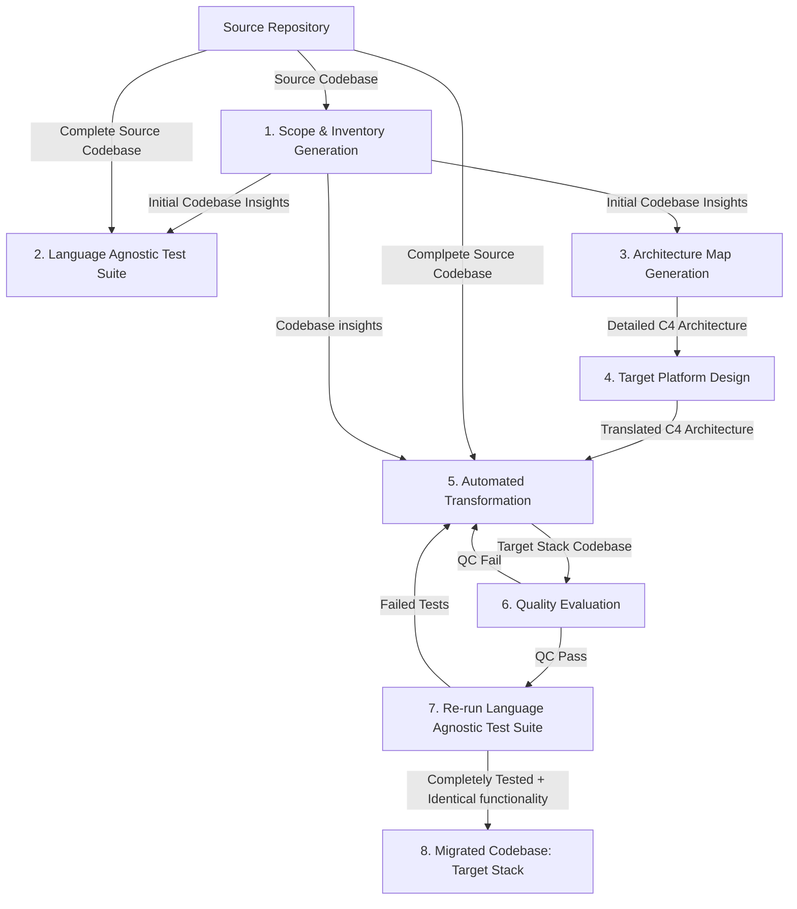

# Master Plan: Codebase Migration System v0.0.1

This is the master plan for v0.0.1 of an **agentic system** for codebase transformation and modernization. The system uses **one intelligent agent** that orchestrates **8 sequential nodes**, each with specialized tools and capabilities to handle different phases of the transformation pipeline.

## Project Structure

```
Refresh/
├── main.py                         # Single agent initialization
├── graph.py                        # Complete pipeline graph (8 nodes)
├── state/
│   ├── __init__.py
│   └── agent_state.py              # Shared state across all nodes
├── nodes/
│   ├── __init__.py
│   ├── scope.py                    # Node 1: Scope & Inventory implementation
│   └── ...                         # Additional nodes (future)
├── tools/
│   ├── __init__.py
│   ├── scope/                      # Tools specific to Node 1
│   │   ├── __init__.py
│   │   └── ...                     # Scope tools go here
│   └── ...                         # Tools for other nodes go here in their respective folders
├── config/
│   ├── __init__.py
│   └── ...                         # Configs go here
├── utils/
│   ├── __init__.py
│   ├── file_utils.py               # File operations
│   └── logging_utils.py            # Logging configuration
├── migration_docs/                 # **Important: these must be markdown files**
│   ├── scope_inventory.md          # Node 1 output 
│   ├── test_suite.md               # Node 2 output (future)
│   └── ...                         # Additional node outputs
└── requirements.txt
```

## Migration Pipeline Architecture



## Architecture

The system consists of **one primary agent** that executes **7 specialized nodes** in sequence to produce the final migrated codebase. Each node can internally loop with multiple LLM calls and different tool bindings, but the overall system remains a cohesive single agent.

### Node 1: Scope & Inventory Generation
**Purpose:** Comprehensive analysis and inventory of the source codebase
**Tools:** File scanners, dependency analyzers, call graph generators, API detectors
**Output:** Complete project inventory, architecture understanding, transformation complexity assessment

### Node 2: Language Agnostic Test Suite  
**Purpose:** Generate comprehensive test suite that captures current system behavior
**Tools:** Test generators, UI automation, API testing, integration test creation
**Output:** Test suite that works identically on source and target systems

### Node 3: Architecture Map Generation
**Purpose:** Create detailed architectural documentation and dependency mapping
**Tools:** Architecture pattern detectors, component relationship mappers, integration analyzers
**Output:** Architectural blueprints, component diagrams, dependency maps

### Node 4: Target Platform Design
**Purpose:** Define target architecture and create transformation strategy
**Tools:** Platform compatibility analyzers, architecture translators, dependency mappers
**Output:** Target platform specifications, transformation roadmap, dependency translations

### Node 5: Automated Transformation
**Purpose:** Execute code transformation from source to target platform
**Tools:** Code translators, syntax converters, framework migrators, configuration transformers
**Output:** Translated codebase in target technology stack

### Node 6: Quality Evaluation
**Purpose:** Validate transformation quality and catch issues early
**Tools:** Build validators, syntax checkers, dependency verifiers, basic functionality tests
**Output:** Quality reports, issue identification, go/no-go decisions
**Loop:** If quality gates fail, return to Node 5 for fixes

### Node 7: Re-run Language Agnostic Test Suite
**Purpose:** Re-run same Language Agnostic Test Suite on transformed code to verify behavioral equivalence
**Tools:** Test execution engines, result comparators, difference analyzers
**Output:** Test results, behavioral verification, divergence reports
**Loop:** If tests fail or diverge, return to Node 5 for corrections  

### Final Output: Migrated Codebase (Target Stack)
The successful completion of the 7-node pipeline results in a fully transformed, tested, and functionally equivalent codebase on the new target technology stack.

## Key Design Principles

### Agent Orchestration
- **One agent** manages the entire pipeline with full context awareness
- **Sequential execution** with conditional loops back to earlier nodes
- **Shared state** across all nodes for context continuity
- **Intelligent routing** between nodes based on results and quality gates

### Node-Level Modularity  
- Each node is **self-contained** with specific responsibilities
- **Internal tool orchestration** within each node as needed
- **Multiple LLM calls** per node with different specialized prompts
- **Tool binding flexibility** - each node uses appropriate tools for its phase

### Quality-Driven Flow Control
- **Continuous validation** at each node
- **Automatic retries** with improved strategies
- **Fallback mechanisms** when primary approaches fail
- **Human-in-the-loop** intervention points when needed

## Implementation Strategy

### Phase 1: Core Infrastructure (Current Focus)
- Agent state management
- LangGraph integration for node orchestration  
- Basic tool binding framework
- Node 1 (Scope & Inventory) implementation

### Phase 2: Test Foundation
- Node 2 (Language Agnostic Test Suite) implementation
- Test execution infrastructure
- Quality gate framework

### Phase 3: Architecture & Planning
- Node 3 (Architecture Map) implementation
- Node 4 (Target Platform Design) implementation
- Migration strategy frameworks

### Phase 4: Transformation Engine
- Node 5 (Automated Transformation) implementation
- Node 6 (Continuous Quality Gates) implementation
- Retry and correction mechanisms

### Phase 5: Verification & Deployment
- Node 7 (Re-run Language Agnostic Test Suite) implementation  
- End-to-end pipeline testing

## Success Criteria

The agent system should:
1. **Analyze any codebase** and generate comprehensive inventory
2. **Create behavioral tests** that work on both source and target  
3. **Map architecture** and plan transformation strategy
4. **Transform code** to target platform automatically
5. **Validate quality** continuously with automatic retry loops
6. **Verify behavior** matches between source and target
7. **Produce a production-ready codebase** on the target stack
8. **Maintain context** and learning across all phases

This architecture ensures a cohesive, intelligent transformation system that can handle complex codebases while maintaining reliability and quality throughout the entire transformation process.